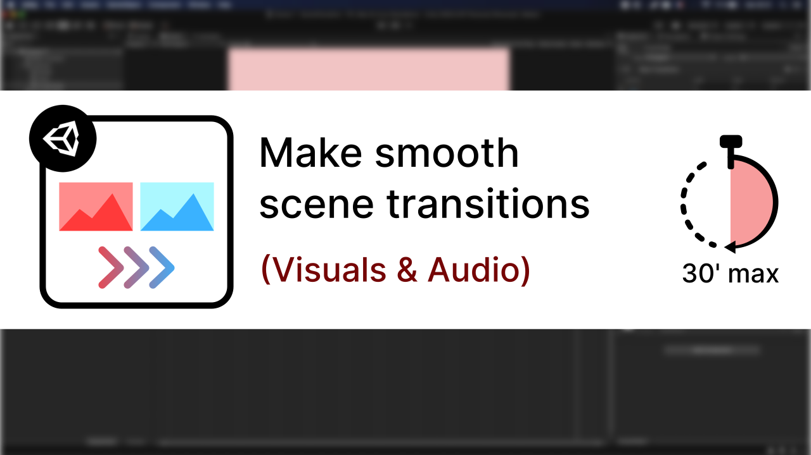
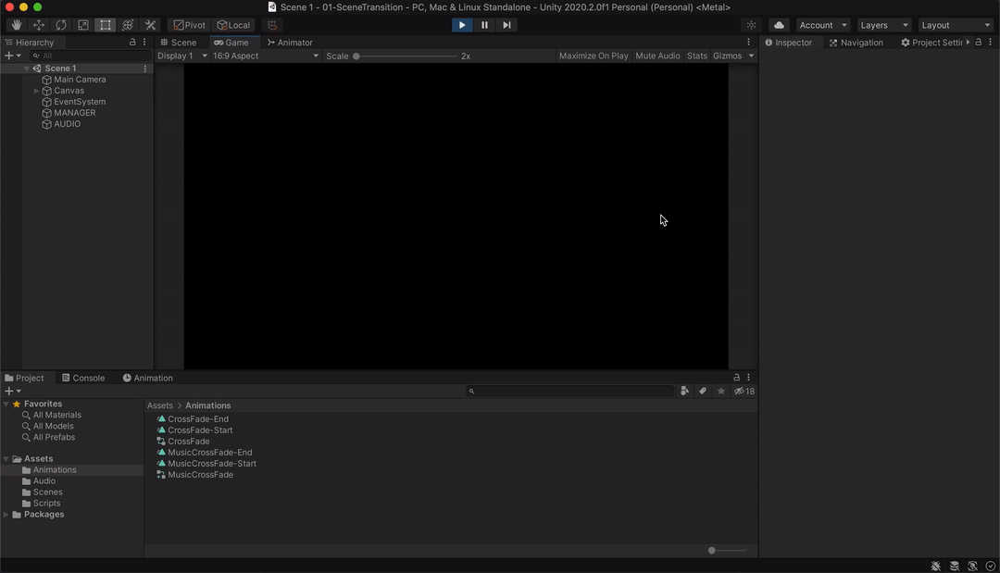

# [Unity/C#] Smooth Scene Transitions

**Mina Pêcheux - July 2021**

How can we use animations to make smooth scene transitions in Unity? Let's discover more in this less-than-30 minutes-tutorial: "How to make smooth scene transitions (visuals & audio) in less than 30 minutes" :)

It's available in text or video format: you can read it [on Medium](https://medium.com/c-sharp-progarmming/make-smooth-scene-transitions-in-unity-c-6b7c97e4c7e0) or watch it [on Youtube](https://www.youtube.com/watch?v=_9L0HJrVR5Y).

In this tutorial, I'm discussing how to take advantage of Unity's animators and overrides to quickly setup scene transitions both for your visuals and your audio. We're looking at fading in and out of the scene with a black screen and an update of the background music volume.

This Github repo contains the assets made and the code written throughout this tutorial:

- the animations and animators
- the scenes setup
- the `SceneLoader` C# script

